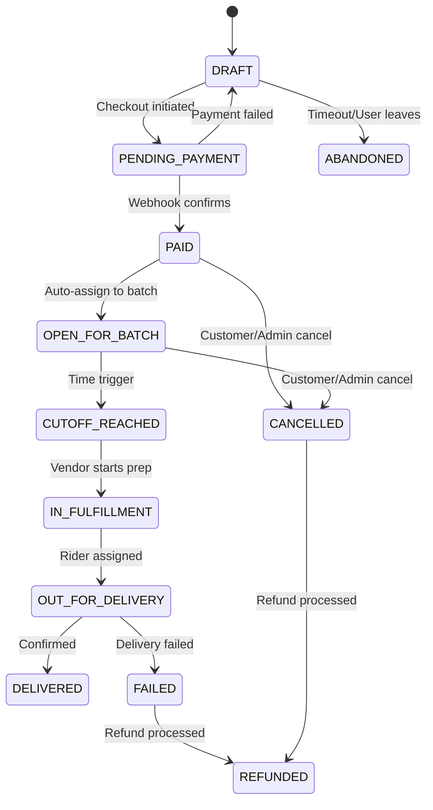
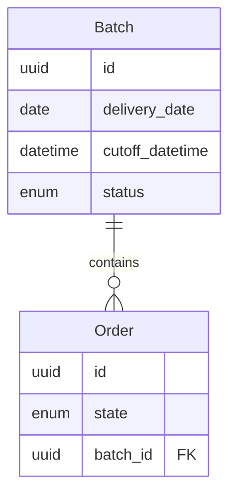

# Order Lifecycle Specification

The order lifecycle is a **time-driven state machine**. No shortcuts, no UI tricks, no manual exceptions without audit logs.

---

## Order States



---

## State Definitions

| State | Description | Who Acts | Customer Can Modify? |
|-------|-------------|----------|---------------------|
| `DRAFT` | In cart, no payment | Customer | ✅ Yes |
| `PENDING_PAYMENT` | Awaiting gateway confirmation | System | ❌ No |
| `PAID` | Payment verified, funds held | System | ❌ No |
| `OPEN_FOR_BATCH` | Eligible for batch, cut-off running | System | ❌ No |
| `CUTOFF_REACHED` | Batch closed, quantities frozen | System | ❌ No |
| `IN_FULFILLMENT` | Vendor preparing items | Vendor | ❌ No |
| `OUT_FOR_DELIVERY` | Rider assigned, tracking active | Rider | ❌ No |
| `DELIVERED` | Confirmed by customer or auto | System | ❌ No |
| `FAILED` | Delivery failed | System | ❌ No |
| `CANCELLED` | Cancelled before fulfillment | Admin/Customer | ❌ No |
| `REFUNDED` | Funds returned | System | ❌ No |
| `ABANDONED` | Cart timeout | System | N/A |

---

## Forbidden Transitions

These transitions are **never allowed**:

| From | To | Reason |
|------|----|--------|
| `PAID` | `DRAFT` | Cannot unpay |
| `CUTOFF_REACHED` | `OPEN_FOR_BATCH` | Time cannot reverse |
| `DELIVERED` | Any prior state | Fulfillment complete |
| `REFUNDED` | Any state | Terminal state |
| Any state | Skip states | Must follow sequence |

---

## Cut-Off Rules

### Definition
A **cut-off** is the final moment when:
- Orders stop being accepted for a batch
- Quantities stop changing
- Vendor obligation becomes enforceable

### Backend Enforcement

```python
# Pseudo-code - Backend enforces, not frontend
if current_time < batch.cutoff_time:
    order.state = "OPEN_FOR_BATCH"
    order.batch = current_batch
else:
    order.state = "OPEN_FOR_BATCH"
    order.batch = next_available_batch
```

### Rules
- ⛔ No frontend override
- ⛔ No admin override without audit log
- ✅ Displayed clearly to customers
- ✅ Countdown visible on product pages

---

## Batch Model

### Batch Structure

| Field | Type | Description |
|-------|------|-------------|
| `id` | UUID | Unique identifier |
| `delivery_date` | Date | When items will be delivered |
| `cutoff_datetime` | DateTime | When orders close |
| `vendor` | FK | Vendor responsible |
| `status` | Enum | `OPEN`, `CLOSED`, `FULFILLED` |

### Batch ↔ Order Relationship



Orders **never float freely**. Every paid order belongs to a batch.

---

## Visibility Rules

### Customer Sees
- ✅ Exact delivery date
- ✅ Countdown to cut-off
- ✅ Message: *"Pre-order closes in 3h 12m. After this, delivery moves to Monday."*

### Vendor Sees
- ✅ Orders only after `PAID` state
- ✅ Locked quantities after `CUTOFF_REACHED`
- ✅ Clear SLA start time
- ❌ No surprise additions

### Admin Can
- ✅ Extend cut-off (logged)
- ✅ Cancel batch (with reason)
- ✅ Penalize vendors
- ✅ Trigger refunds
- 📝 All actions are audited

---

## Implementation Checklist

- [ ] Define `OrderState` enum in backend
- [ ] Create `Batch` model with cut-off logic
- [ ] Implement state transition validator
- [ ] Create Celery task for cut-off triggers
- [ ] Build audit log for admin actions
- [ ] Add countdown component to frontend
- [ ] Test forbidden transitions
